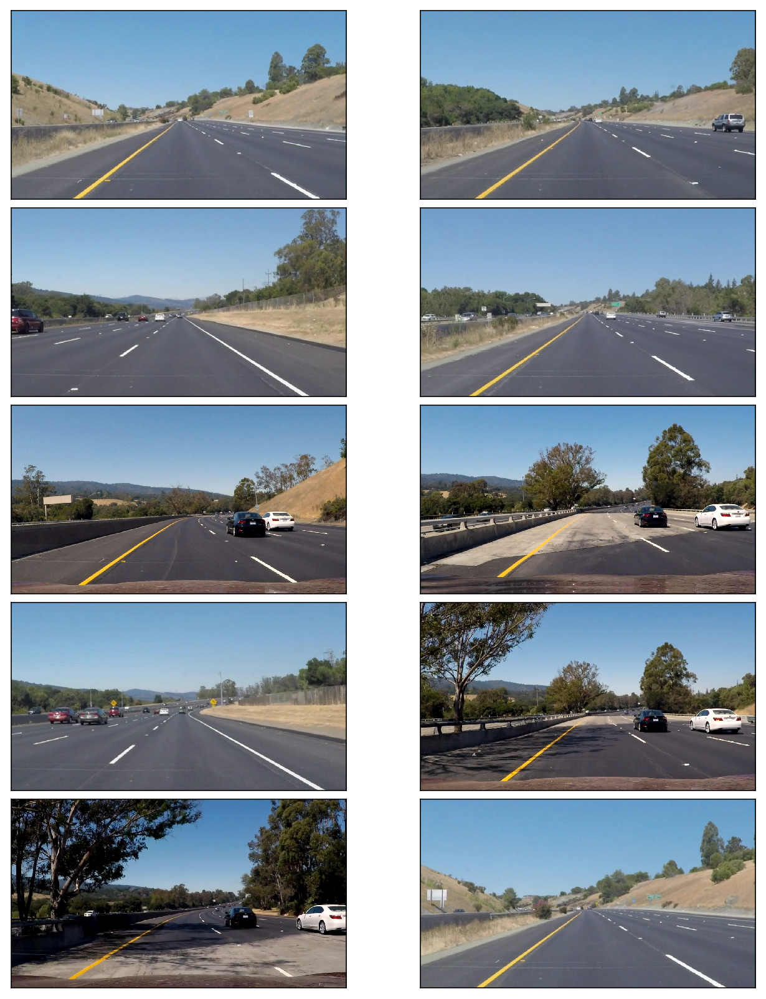
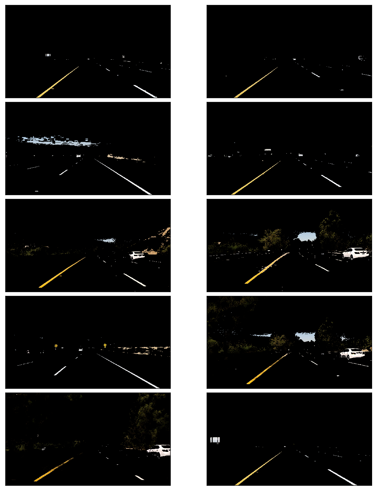
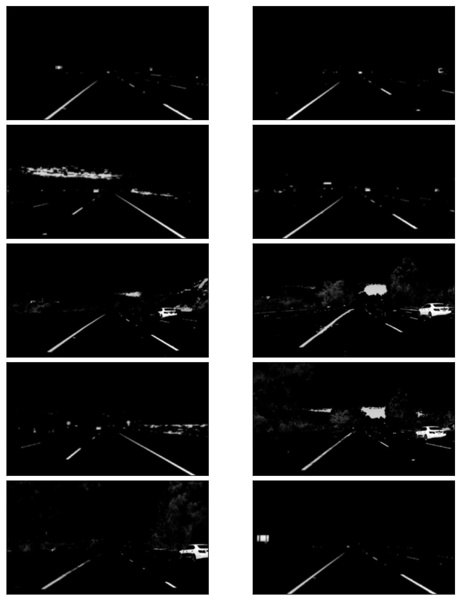
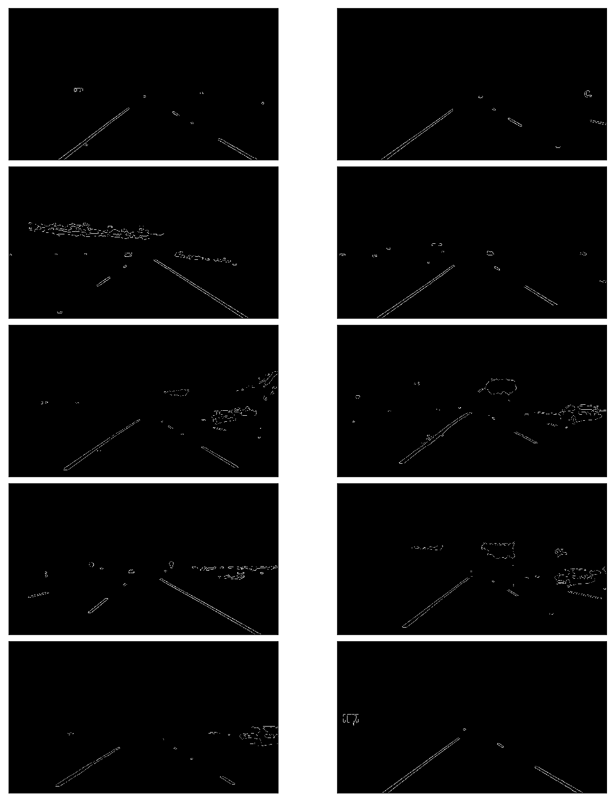
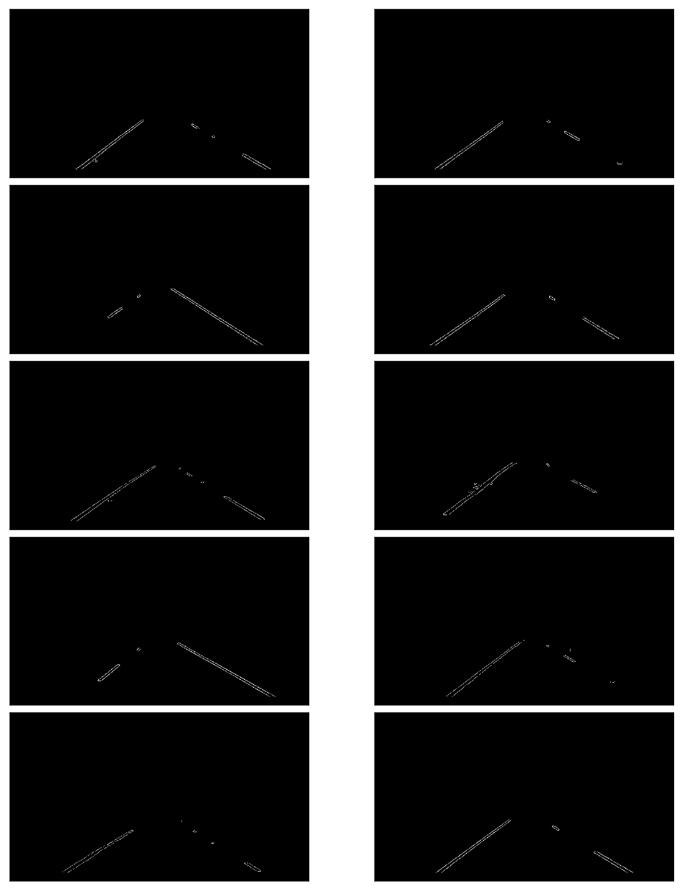

# **Finding Lane Lines on the Road** 

## Overview

When we drive, we use our eyes to decide where to go.  The lines on the road that show us where the lanes are act as our constant reference for where to steer the vehicle.  Naturally, one of the first things we would like to do in developing a self-driving car is to automatically detect lane lines using an algorithm.

In this project you will detect lane lines in images using Python and OpenCV.  OpenCV means "Open-Source Computer Vision", which is a package that has many useful tools for analyzing images.  

## Dependencies

If you have already installed all the necessary dependencies for the projects in term 1 you should be good to go! If not, you should install them to get started on this project => [Getting Started for Term 1](../term1_How_to_get_started). 
 
## Basic Build Instructions

1. Clone or fork this repository.
2. Launch the Jupyter notebook: `jupyter notebook lane_finding.ipynb`
3. Execute the code cells you are interested in. Note that cells may depend on previous cells. The notebook explains clearly what each code cell does.

## Goal of this project

The first goal of this project was to **detect road lines** in an image taken from a roof-mounted camera. The next goal was to **create a simple detection pipeline** which could be applied to a video stream gathered with this camera. Different highway driving situations are available with a distinct level of  complexity in detection. This is just a **computer vision** project without any machine learning, but some tuning work to do. 

## General Process

The following techniques are used:

- Color Selection
- Canny Edge Detection
- Region of Interest Selection
- Hough Transform Line Detection

Finally, I applied all the techniques to process video clips to find lane lines in them.

## Test Images

Let's load and examine the test images.

Lines are in white or yellow.  A white lane is a series of alternating dots and short lines, which we need to detect as one line.

## Color Selection

### RGB Color Space

The images are loaded in RGB color space.  Let's try selecting only yellow and white colors in the images using the RGB channels.

Reference: [RGB Color Code Chart](http://www.rapidtables.com/web/color/RGB_Color.htm)

It looks pretty good except the two in which the yellow lines are not clear due to the dark shade from the tree on the left.

## Canny Edge Detection

We want to detect edges in order to find straight lines especially lane lines.  For this, 

- use `cv2.cvtColor` to convert images into gray scale
- use `cv2.GaussianBlur` to smooth out rough edges 
- use `cv2.Canny` to find edges

Note: [Canny Edge Detection Wikipedia](https://en.wikipedia.org/wiki/Canny_edge_detector) has a good description in good details.

### Gray Scaling

The images should be converted into gray scaled ones in order to detect shapes (edges) in the images.  This is because the Canny edge detection measures the magnitude of pixel intensity changes or gradients (more on this later).

Here, I'm converting the white and yellow line images from the above into gray scale for edge detection.

### Gaussian Smoothing (Gaussian Blur)

When there is an edge (i.e. a line), the pixel intensity changes rapidly (i.e. from 0 to 255) which we want to detect.  But before doing so, we should make the edges smoother.  As you can see,  the above images have many rough edges which causes many noisy edges to be detected.

I use `cv2.GaussianBlur` to smooth out edges.

- [Gaussian Filter OpenCV Theory](http://docs.opencv.org/doc/tutorials/imgproc/gausian_median_blur_bilateral_filter/gausian_median_blur_bilateral_filter.html#gaussian-filter)
- [cv2.GaussianBlur OpenCV API Reference](http://docs.opencv.org/modules/imgproc/doc/filtering.html?highlight=gaussianblur#gaussianblur)

### Edge Detection

- use`cv2.Canny` for detecting edges .

- [Canny Edge Detection OpenCV Theory](http://docs.opencv.org/2.4/doc/tutorials/imgproc/imgtrans/canny_detector/canny_detector.html)
- [cv2.Canny OpenCV API Reference](http://docs.opencv.org/doc/tutorials/imgproc/imgtrans/canny_detector/canny_detector.html)

## Region of Interest Selection

When finding lane lines, we don't need to check the sky and the hills.  

Roughly speaking, we are interested in the area surrounded by the red lines below:

So, we exclude outside the region of interest by apply a mask.

- [cv2.fillPoly OpenCV API Reference](http://docs.opencv.org/modules/core/doc/drawing_functions.html#fillpoly)

## Hough Transform Line Detection

I'm using `cv2.HoughLinesP` to detect lines in the edge images.

More details can be found:

- [Hough Line Transform OpenCV Theory](http://docs.opencv.org/doc/tutorials/imgproc/imgtrans/hough_lines/hough_lines.html)
- [cv.HoughLinesP OpenCV API Reference](http://docs.opencv.org/modules/imgproc/doc/feature_detection.html?highlight=houghlinesp#houghlinesp)

### Averaging and Extrapolating Lines

There are multiple lines detected for a lane line.  We should come up with an averaged line for that.

Also, some lane lines are only partially recognized.  We should extrapolate the line to cover full lane line length.

We want two lane lines: one for the left and the other for the right.  The left lane should have a positive slope, and the right lane should have a negative slope.  Therefore, we'll collect positive slope lines and negative slope lines separately and take averages.

Note: in the image, `y` coordinate is reversed.  The higher `y` value is actually lower in the image.  Therefore, the slope is negative for the left lane, and the slope is positive for the right lane.

## Video Clips

I'm drawing lanes on video clips.

The video inputs are in test_videos_output folder.  The video outputs are generated in output_videos folder.

## Conclusion

The project was successful in that the video images clearly show the lane lines are detected properly and lines are very smoothly handled.

